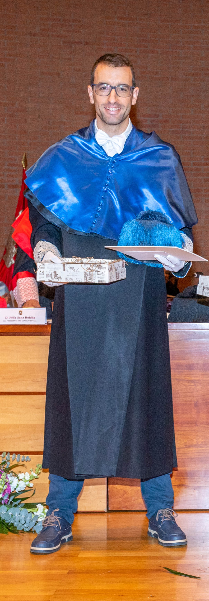

</style>

## ALUMNI-UCLM - Research
[ALUMNI-UCLM 2023](https://www.uclm.es/misiones/lauclm/consejodedireccion/vpu/destacados) as a recognition for my research career as part of the Univesity of Castilla-La Mancha [UCLM](https://www.uclm.es/)

## Extraordinary award PhD
Recognition of excellence in my PhD thesis **"Developing and harmonizing camera trap methods to estimate population density and movement parameters of unmarked populations: the random encounter model"** (*Cum-laude*)

## Extraordinary award Master
Recognition as the best student in the master's degree **Basic and applied research in game and wildlife resources, 2017**. (9.4/10)

## Extraordinary award Bachelor
Recognition as the best student in the Bsc's degree **Environmental Sciences, 2016**. (8.67/10)

