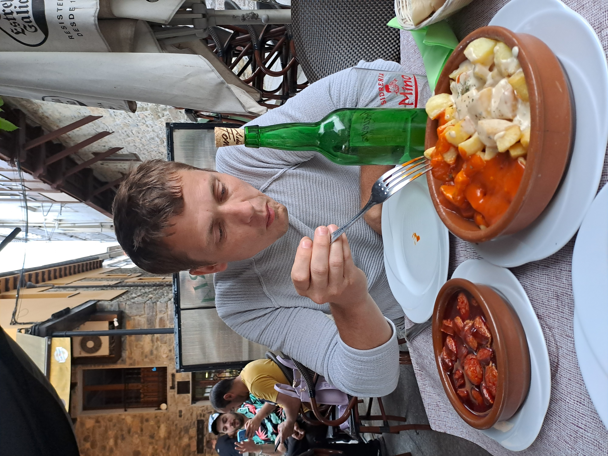

# Postdoctoral researchers

## 2024

### Dr Plhal
</style>

[Dr Plhal](https://www.researchgate.net/profile/Radim-Plhal) is a researcher affiliated at Mendel University in Brno.He is interested in wild boar ecology, with a especial interest in management. During his visit, we worked on designing program to monitor wild boar population in Czech Republic. We also found time for a couple of days on the field, and even more relevant... he discovered 'sidra' and enjoyed Asturian gastronomy.

 
 

# PhD students

## 2024

### Miss Escobar