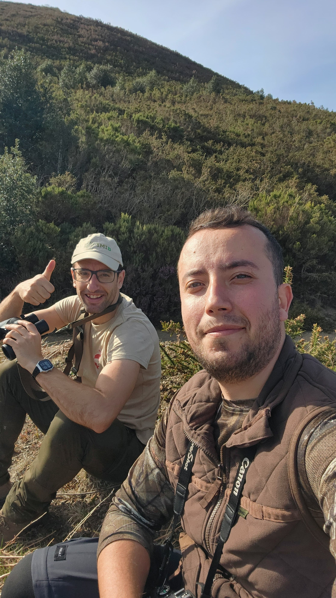
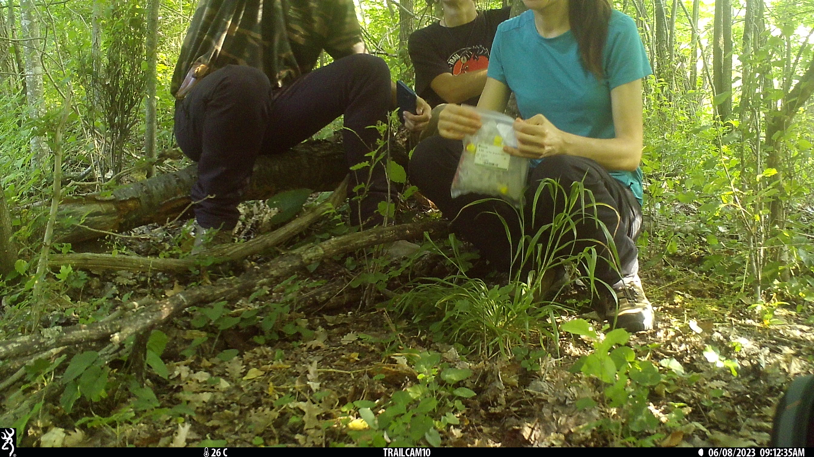

# **Host**

### *Pedro Girotti*

[Mr Girotti](https://www.researchgate.net/profile/Pedro-Girotti) is a PhD student affiliated at the University of Tuscia in Italy. He is interested in monitoring ungulates populations in central Italy using camera traps. During his visit, we worked on REST and REM, and I also took the opportunity to introduce him to photogrammetry. 
 

 
 

### *Alí Çelík*

[Mr Çelik](https://www.researchgate.net/profile/Ali-Celik-18) is a PhD student affiliated at Karadeniz Technical University in Turkey.He is interested in monitoring red deer populations in Turkey. During his visit, we worked on designing a camera trapping experiment to monitor red deer and predators (in his study area, the presence of wolves, bears, jackals and feral dogs is common!). 
 

 
 

### *Radim Plhal*

[Dr Plhal](https://www.researchgate.net/profile/Radim-Plhal) is a postdoctoral researcher affiliated at Mendel University in Brno.He is interested in wild boar ecology, with a especial interest in management. During his visit, we worked on designing program to monitor wild boar population in Czech Republic. We also found time for a couple of days on the field, and even more relevant... he discovered 'sidra' and enjoyed Asturian gastronomy.
 
{width=70%}

 
 

### *Mery Escobar*

[Miss Escobar](https://www.researchgate.net/profile/Radim-Plhal) is a PhD student affiliated at Autonomus Univesity of Barcelona. She is interested in urban and peri-urban wild boar populations in the area of Barcelona (Spain) (Did you know that one of these wild boars stole Shakira's mobile?? [See here](https://www.elespectador.com/entretenimiento/gente/shakira-fue-atacada-por-jabalies-en-parque-de-barcelona/). During his visit, we worked on the analysis of camera trapping data, especially focused on estimate population density applying random encounter model. Mery also joined in the experiments we had going on...as this picture (almost!) proves.
 

 
 

# **Supervision**

### *PhD thesis*
I have participated in the supervision of PhD chapters of four different thesis.

- **PhD student**: M. Escobar; **Chapter title** Seasonal variability in wildlife monitoring: Random Encounter Model and interaction Networks in peri-urban wild boar; **University** Autonomous University of Barcelona (Spain)

- **PhD student**: Z. Delisle; **Chapter title** [Reducing bias in density estimates for unmarked populations that exhibit reactive behaviour towards camera traps](https://besjournals.onlinelibrary.wiley.com/doi/10.1111/2041-210X.14247); **University** Purdue University (USA)	

- **PhD student**: A. Zampetti; **Chapter title** [Towards an automated protocol for wildlife density estimation using camera-traps](https://besjournals.onlinelibrary.wiley.com/doi/full/10.1111/2041-210X.14450); **University** Sapienza University of Rome (Italy)	

- **PhD student**: M. Theng; **Chapter title** Performance of camera trap-based density estimators for unmarked populations; **University** University of Adelaide (Australia)	

### *MSc and BSc thesis*
I have supervised four BSc and three MSc thesis. These theses have addressed different aspects related to the monitoring and study of wildlife. Some examples:

- **Student**: I. García; **Title**: Emerging technologies in mammal research: use and application of camera trapping; **University**:  University of Castilla-La Mancha (Spain), *Environmental sciences* (8.5/10)	

- **Student**: D. González; **Title**: Factors affecting the detectability of wildlife at wind farms: the role of vertebrate scavengers; **University**: University of Oviedo (Spain), *Biology* (9/10)	

- **Student**: B. Fernandez; **Title** Evaluation of animal behaviour patterns in camera-trapping studies; **University**: University of Castilla-La Mancha (Spain), *Environmental sciences* (7.8/10)	

- **Student**: A. Díaz; **Title**: Effect of the season on population density estimates of red deer *Cervus elaphus* obtained by distance sampling; **University**: University of Castilla-La Mancha (Spain), *Environmental sciences*	(8.6/10)

