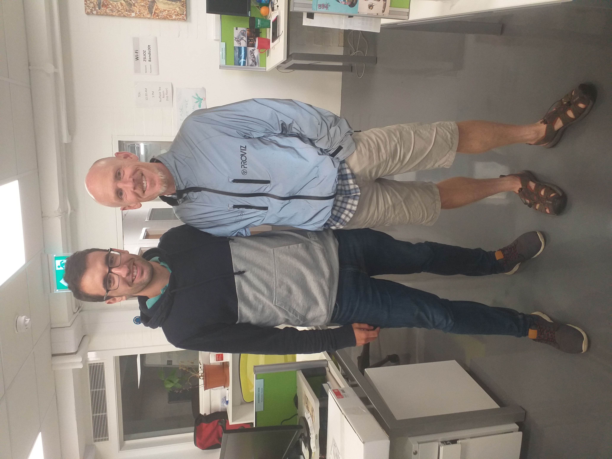

I have visited research institutions abroad at [United Kingdom](#ZSL), [Sweden](#SLU) and [Italy](#UniTo). I have been also affiliated in two research institutions in Spain. In total, I have co-authored manuscripts with **112 researchers** from **18 countries**.

</figure>

<figcaption style="font-size: 0.85em; color: #082a64;">
Node plot showing the 112 authors I have published research articles. Node and label size is proportional to the number of collaborations. Each colour represents a country, been the most frequent: purple (Spain), green (Italy), pink (USA), orange (Canada).
</figcaption>

</figure>

## **Biodiversity Research Insitute - University of Oviedo** (IMIB - UniOvi)
Since January 2024, I am currently affiliated with [IMIB](https://imib.csic.es/) as a postdoctoral researcher under the supervision of [Dra Mateo-Tomás](https://scholar.google.es/citations?user=N9VkCNIAAAAJ&hl=es&oi=ao). I got funding for this contract in a competitive call funded by the “Spanish Ministry of Science and Innovation – Juan de la Cierva” (76,548.42€). I am focused on the utility of non-lethal alternatives to reduce predators’ impact on endangered species considering capercaillie populations as a case of study. Some [results about that are already published](https://link.springer.com/article/10.1007/s10344-024-01837-9), but still many thing to do! I am also working on artificial intelligence models to identify animals affected by sarcoptic mange; and exploring the reliability of camera trapping to estimate wolf population density.

## **University of Turin** (UniTo) {#UniTO}

## **Swedish University of Agricultural Sciences** (SLU) {#SLU}

## **Zoological Society of London - Institute of Zoology** (ZSL-IoZ) {#ZSL}

  

              I visited ZSL-IoZ in 2019 for 3 months under the supervision of [Prof Rowcliffe](https://www.zsl.org/about-zsl/our-people/prof-marcus-rowcliffe). I got funding for this stay in the competitive call “on the move” funded by the “Society of Spanish Researchers in the United Kingdom - (6,600€)”. During this stay, I got experience in random encounter model (REM), a method to estimate population density without the need for individual recognition; Prof Rowcliffe described this method in 2008. The stay was not only focused REM, but also in other unmarked methods, such as CTDS and REST. As a result of this stay, I published [this article](https://besjournals.onlinelibrary.wiley.com/doi/10.1111/1365-2664.13913) in *Journal of Applied Ecology* (to this day, this is the article with the greatest repercussion of all the articles I have published!)
  

  

 
  

---

I visited ZSL-IoZ in 2019 for 3 months under the supervision of [Prof Rowcliffe](https://www.zsl.org/about-zsl/our-people/prof-marcus-rowcliffe). I got funding for this stay in the competitive call “on the move” funded by the “Society of Spanish Researchers in the United Kingdom - (6,600€)”. During this stay, I got experience in random encounter model (REM), a method to estimate population density without the need for individual recognition; Prof Rowcliffe described this method in 2008. The stay was not only focused REM, but also in other unmarked methods, such as CTDS and REST. As a result of this stay, I published [this article](https://besjournals.onlinelibrary.wiley.com/doi/10.1111/1365-2664.13913) in *Journal of Applied Ecology* (to this day, this is the article with the greatest repercussion of all the articles I have published!)
</figure>

