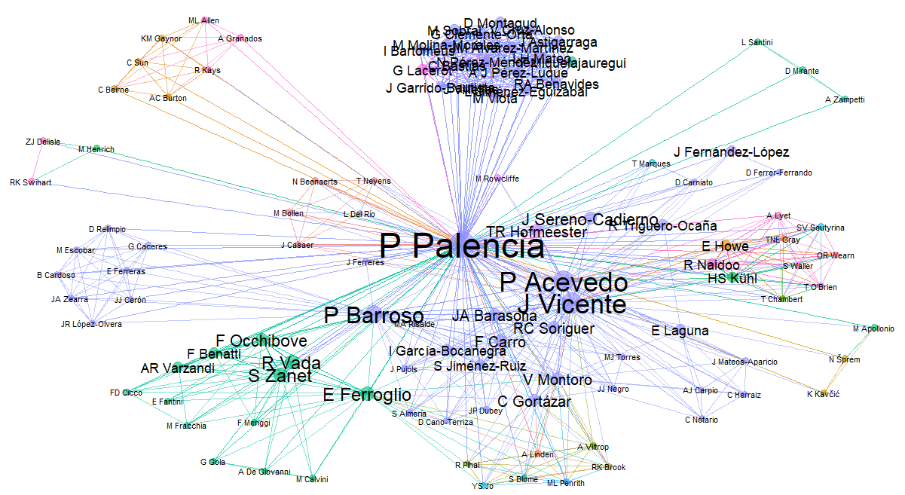
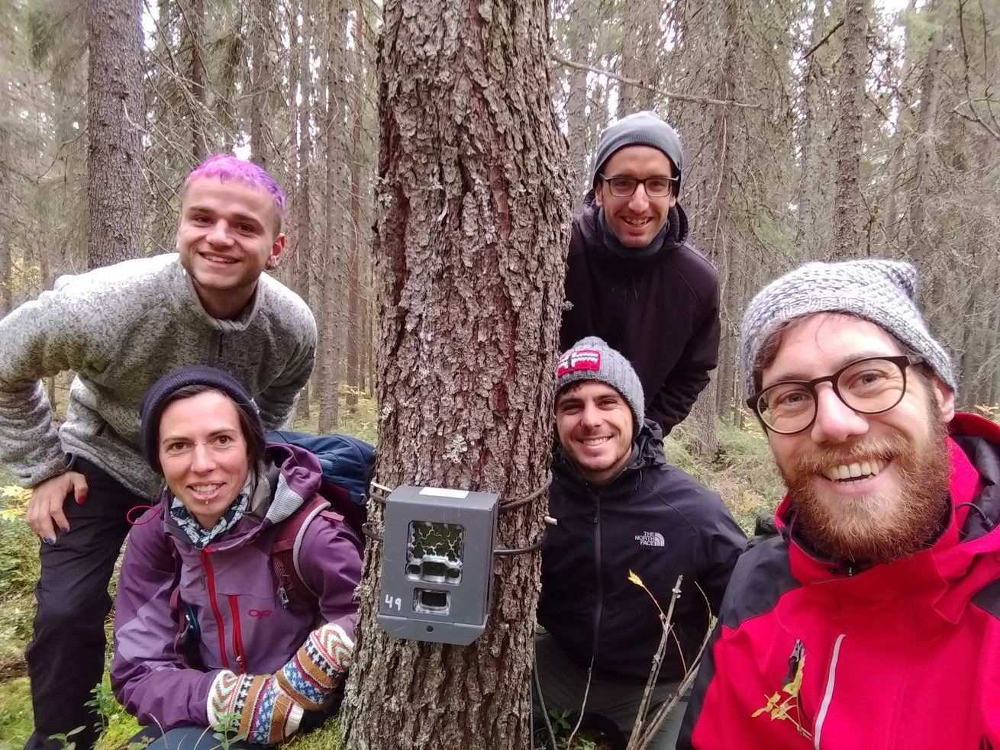
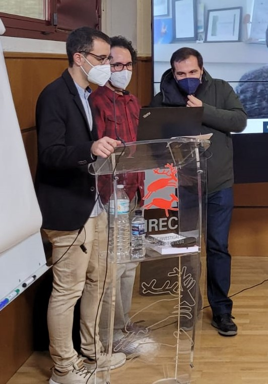

I have visited research institutions abroad at [United Kingdom](#ZSL), [Sweden](#SLU) and [Italy](#UniTo). I have been also affiliated in two research institutions in Spain. In total, I have co-authored manuscripts with **112 researchers** from **18 countries**.

</figure>

{width=80%}
<figcaption style="font-size: 0.85em; color: #082a64;">
Node plot showing the 112 authors I have published research articles. Node and label size is proportional to the number of collaborations. Each colour represents a country, been the most frequent: purple (Spain), green (Italy), pink (USA), orange (Canada).
</figcaption>

</figure>
 
 

## **Biodiversity Research Insitute - University of Oviedo** (IMIB - UniOvi)
Since January 2024, I am currently affiliated with [IMIB](https://imib.csic.es/) as a postdoctoral researcher under the supervision of [Dra Mateo-Tomás](https://scholar.google.es/citations?user=N9VkCNIAAAAJ&hl=es&oi=ao). I got funding for this contract in a competitive call funded by the “Spanish Ministry of Science and Innovation – Juan de la Cierva” (76,548.42€). I am focused on the utility of non-lethal alternatives to reduce predators’ impact on endangered species. Particularly, I am testing the utility of **diversionary feeding** (deliberate provisioning of food to explore the propensity of individuals to exploit the most easily accessed resource) to reduce predators' impact on capercaillie. Some [results about that are already published](https://link.springer.com/article/10.1007/s10344-024-01837-9), but still many thing to do! I am also working on **artificial intelligence** models to identify animals affected by sarcoptic mange; and exploring the reliability of camera trapping to estimate wolf population density.
 
 

## **University of Turin** (UniTo) {#UniTO}

Just 12 days after my PhD viva, the first case of a wild boar infected positive to **African swine fever** (ASF) was reported in mainland Italy (ASF is a widespread virus causing 90% mortality rates in wild boar and domestic pig). Thus, I packed my bags and moved to Turin to join [Prof Ferroglio group](https://scholar.google.es/citations?user=oJ5vKjMAAAAJ&hl=es&oi=ao). I got funding for this stay in two competitive calls, one of them funded by UniTo, and the second funded by the “University of Castilla-La Mancha – Margarita Salas contracts (86,153.88€)”. We there monitored the core zone where the outbreak was detected (Capanne di Marcarolo Natural Park, I miss you Marcarolo squadra!), and front-like zones, camera trapping is very useful in the context of [ASF emergence!](https://onlinelibrary.wiley.com/doi/full/10.1155/2023/7820538?msockid=198d1e9a20b862c23d1d0b8b2110631c). In addition to camera trapping, we also used [environmental DNA](https://link.springer.com/article/10.1007/s10344-023-01758-z) in the context of ASF management. I also continue to work on other aspects not related to ASF-wild boar, such as monitoring porcupine populations, or [fine-tuning methods to estimate population density](https://besjournals.onlinelibrary.wiley.com/doi/10.1111/2041-210X.14247).

{width=250px}

 
 

## **Swedish University of Agricultural Sciences** (SLU) {#SLU}

I visited SLU in 2021 for 3 months under the supervision of [Dr Hofmeester](hhttps://www.slu.se/en/ew-cv/tim-hofmeester2/). I got funding for this stay in the competitive call funded by the “Spanish Ministry of Universities - (4,740€)”. During this stay, I was focused on comparing REM densities against reference ones; and we also started to evaluate the variability in movement patterns in terrestrial mammals. As a result of this stay, I published [this article](https://zslpublications.onlinelibrary.wiley.com/doi/full/10.1002/rse2.269) in *Remote Sensing in Ecology and Conservation*. There was time also for the fieldwork, for instance setting cameras for SNAPSHOTEUROPE... and spotting nice fauna (moose, and my first capercaillie!). The collaboration with Tim was so nice, so we have continue collaborating... For instance, exploring the variability in movement patterns across populations (more [here](https://zslpublications.onlinelibrary.wiley.com/doi/full/10.1002/rse2.269)). 

{width=270px}

 
 

## **Zoological Society of London - Institute of Zoology** (ZSL-IoZ) {#ZSL}

I visited ZSL-IoZ in 2019 for 3 months under the supervision of [Prof Rowcliffe](https://www.zsl.org/about-zsl/our-people/prof-marcus-rowcliffe). I got funding for this stay in the competitive call “on the move” funded by the “Society of Spanish Researchers in the United Kingdom - (6,600€)”. During this stay, I got experience in random encounter model (REM), a method to estimate population density without the need for individual recognition; Prof Rowcliffe described this method in 2008. The stay was not only focused REM, but also in other unmarked methods, such as CTDS and REST. As a result of this stay, I published [this article](https://besjournals.onlinelibrary.wiley.com/doi/10.1111/1365-2664.13913) in *Journal of Applied Ecology* (to this day, this is the article with the greatest repercussion of all the articles I have published!)

{width=270px}

## **Game and Wildlife Research Institute - University of Castilla-La Mancha** (IREC-UCLM) 

I at landed at [IREC](https://www.irec.es/) for the first time in June, 2015 as an internship student under the supervision of [Dr Vicente](https://scholar.google.es/citations?user=LKuXcdsAAAAJ&hl=es&oi=ao), I enjoyed this period placing cameras, capturing and tagging with telemetry collars wild ungulates, and vaccinating wild boar against tuberculosis... One year later, I returned as a research fellow to carry out estimates of ungulate abundance by distance sampling. I started the master [MUIBARC](https://www.uclm.es/estudios/masteres/master-investigacion-recursos-cinegeticos), got another scholarship to start my research, and shortly after, a 4-year contract from the Spanish Ministry (FPU - 98,227.26€) to do my PhD thesis. [Dr Acevedo](https://scholar.google.es/citations?user=vecKO2QAAAAJ&hl=es&oi=ao) and Dr Vicente were my supervisors. In this period, I worked on the development, fine-tuning and harmonisation of methods to estimate wildlife population density, mainly working with camera trapping and unmarked populations. In these four and a half years I published up to 6 articles as first author, in journals such as *Journal of Applied Ecology*, *Methods in Ecology and Evolution* and *Remote Sensing in Ecology and Conservation*, among others. In addition, I published other articles as co-author, supervised students, presented papers at conferences...

{width=92%}