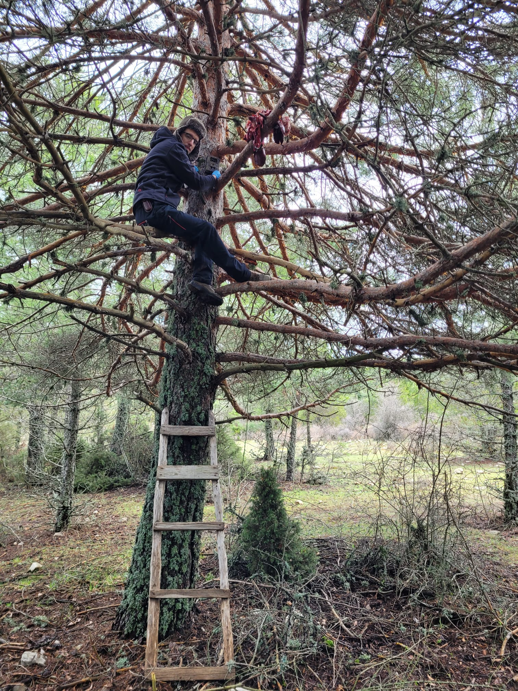
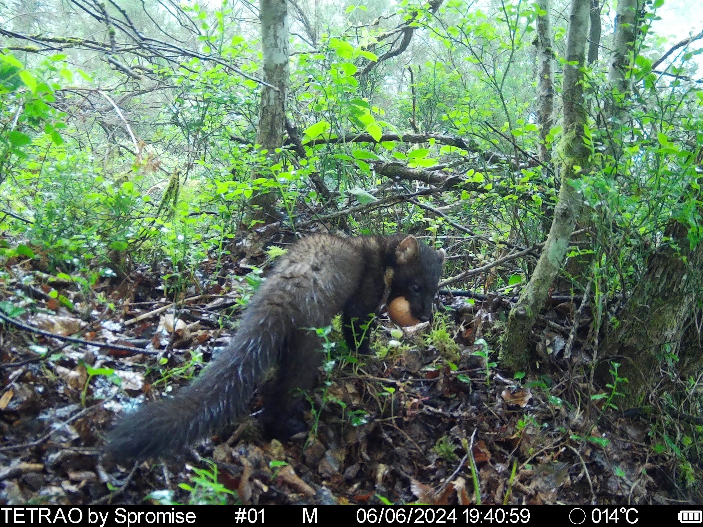
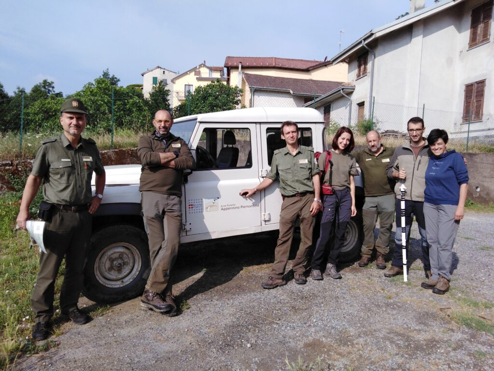

My research is focused on **developing and fine-tuning cutting-edge tools for wildlife management and conservation**. Below you can find a short description of the main research lines in which I focus my research.

 
 

# **Projects**

## **Impact of diversionary feeding at population level**
 

Recent studies concluded that ground-nesting birds are 86 % more likely to decline than birds with other nesting strategies, and indeed, 74% of ground-nesting species were in decline. Predator control has been traditionally used, but this is controversial, cost-prohibitive and has ethical limitations. In this context, **diversionary feeding** (deliberate provisioning of food to explore the propensity of individuals to exploit the most easily accessed resource). In collaboration with colleagues from [IREC](https://www.irec.es/) we are assessing a key question about diversionary feeding: how diversionary feeding affects in terms of abundance, aggregation, occupancy, etc predators' populations. Preliminary results suggested that diversionary feeding has not effect on predators occupancy nor aggregation (more soon!).

 
{width=70%}
 

## **Utility of diversionary feeding on reducing predators impact on ground-nesting birds**

Related to the previous section, I am also assessing the utility of diversionary feeding to reduce the predators impact on ground nest. Particularly, I am working in the Pyrenees and Cantabrian Mountains (Spain), where capercaillie (*Tetrao urogallus*) is experiencing a strong decline. The western capercaillie is a Eurasian species that inhabits the extensive boreal coniferous forests of northern Europe and Asia, as well as the large mountain ranges of southern Europe (including the Alps, Balkans, the Carpathians, the Jura Mountains, the Pyrenees, and the Cantabrian Mountains). While the species status is “Least concern” according to the IUCN, the global population trend is decreasing, with a severe decline in many regions -particularly in southern and central Europe, and Scotland-, and even extinction in others.Previous studies have suggested that poor breeding success rather than mortality of full-grown birds was responsible for the decline of capercaillie. More relevant, recent studies have also demonstrated that [diversionary feeding increase capercaillie' productivity](https://www.biorxiv.org/content/10.1101/2024.12.06.627135v1). I am now evaluating if diversionary feeding could be also considered an effective conservation tool to revert capercaillie decline in the Pyrenees and Cantabrian Mountains. 

 

{width=70%}
 

## **Camera trapping box: survey design, camera performance, etc.**

I have worked (and continue to work) on various jobs related to the operation of cameras, and key points when designing a camera trapping study. We carried out an experiment in which [we compared  camera traps](https://zslpublications.onlinelibrary.wiley.com/doi/full/10.1111/jzo.12945) (including Reconyx, Bushnell, Scoutguard, Ltl Acorn and Keepguard) and identified the main factors that determine whether an animal passes in front of a camera and is detected (or not). Spoiler, cameras miss a lot more than they detect, never forget that!
I am also involved in other studies in which we evaluated the effect of placing three cameras per sampling point (not in the same tree, but in the surrounding area) on detection rates. We also evaluated the effect of changing camera locations instead of keeping them fixed for the whole study period, etc. Briefly, we demonstrated that clustered designs (three cameras per sampling point) resulted in an increase in the precision of detection rates compared to single designs (one camera per sampling point) when a fixed number of sampling points were monitored. When a fixed number of cameras were available, rotating the cameras to new independent sampling points improved precision when monitoring aggregated populations. [More here!](https://besjournals.onlinelibrary.wiley.com/doi/full/10.1111/1365-2664.14690).

 
{width=70%}

 

## **African swine fever emergence**

African swine fever (ASF) is a virus causing 90% mortality in wild boar and domestic pigs. During my first postdoc, I focused my research to monitor wild boar populations in north Italy, were the first case of an infected wild boar was reported just 15 days after my thesis viva. First, I led a [review on management tools](https://link.springer.com/article/10.1007/s10344-023-01696-w) and opportunities for ASF control in wild boar populations. Then, we established a monitoring program in north Italy, in zones infected (e.g. Capanne di Marcarolo Natural Park, see picture with Marcaroli's) and border zones (Po valley, Pavia region, etc). It was not only about camera trapping, but also environmental DNA [**(eDNA)**](https://link.springer.com/article/10.1007/s10344-023-01758-z).

 

{width=70%}

 

## **Density estimation & unmarked populations**

This is likely my main research line. I dedicate my [PhD](https://www.researchgate.net/publication/356878289_Developing_and_harmonizing_camera_trap_methods_to_estimate_population_density_and_movement_parameters_of_unmarked_populations_the_random_encounter_model) to develop and harmonize camera trapping methods to estimate population density of unmarked populations (those in which is not possible to identify animals). I have been especially focused on random encounter model **(REM)**, [comparing its reliability against benchmark methods](https://zslpublications.onlinelibrary.wiley.com/doi/full/10.1002/rse2.269), comparing its [performance against other camera trapping unmarked methods](https://besjournals.onlinelibrary.wiley.com/doi/10.1111/1365-2664.13913), [optimizing its applicability](https://zslpublications.onlinelibrary.wiley.com/doi/full/10.1111/jzo.13204), etc.
I have also experience in other unmarked methods, such as camera-trap distance sampling **(CTDS)**, space to event model (STE), and random encounter and staying time (REST). For instance, I used CTDS to estimate crested porcupine (*Hystrix cristata*) [density on its northern distribution range in Europe](https://onlinelibrary.wiley.com/doi/full/10.1002/ece3.10793?msockid=198d1e9a20b862c23d1d0b8b2110631c). I have also experience in other methods, such as Spatial capture–recapture **(SCR)** and line and point distance sampling **(DS)**.

 
{width=70%}

## **Camera trapping & movement ecology**

Capturing and tagging with telemetry wild animals is time-consuming and not flexible in some situations. Expanding the utility of camera trapping in movement ecology studies is something in which I am particularly interested. I have been focused on day range (daily distance traveled), which is a key parameter in REM. I have also expanded the utility of camera trapping in this topic by publishing the R package [**trappingmotion**](https://github.com/PabloPalencia/trappingmotion), which integrates movement and behaviour ecology from camera trapping. We have demostrated that camera trapping is not only useful to estimate wildlife activity patterns, but also [movement speed and day range](https://besjournals.onlinelibrary.wiley.com/doi/10.1111/2041-210X.13609).

 

## **Integrated wildlife monitoring**

Integrated wildlife monitoring merges wildlife health and host community monitoring for effective disease management and prevention. I did my PhD in a “health and biotechnology group [(SaBio)](https://www.irec.es/investigacion/grupos-de-investigacion/sanidad-y-biotecnologia-sabio/)”, and my first postdoc in a Veterinary Faculty [(UniTo)](https://www.clmveterinaria.unito.it/do/home.pl), so I have led the host community monitoring in several studies. I have worked with shared diseases between wildlife and livestock such as African swine fever (ASF), bovine tuberculosis, sarcoptic mange, toxoplasma gondii or bluetongue among others. I dedicated my first postdoc at the University of Turin to design, implement (in collaboration with Italian authorities) and fine-tuning an integrated wildlife monitoring program to monitor the spread of ASF in the infected populations of Italy.

 
{width=70%}
 