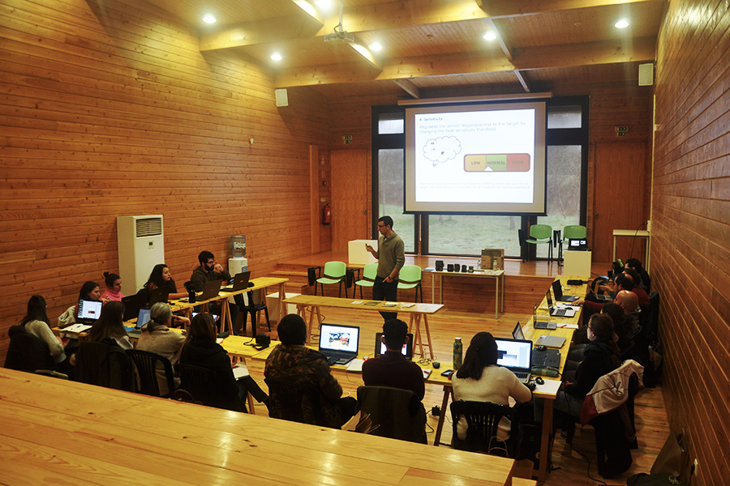
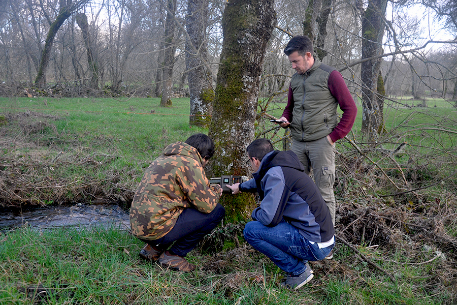

# **University level**
I have lectured for 215 hours at the BSc and Master level in subjects related with wildlife management and conservation, ecology, biological conservation, etc.

- **Degree**: Bsc in Civil Engineering 
  **Subject** Environmental impact assessment  
  **University** University of Oviedo
  
- **Degree**: Msc in Civil Engineering 
  **Subject** Ecology and Environmental Impact  
  **University** University of Oviedo
  
- **Degree**: Msc Forestry and Environmental Engineering 
  **Subject** Management of Natural Protected Areas  
  **University** University of Oviedo
  
- **Degree**: Msc Biotechnology Applied to the Conservation and Conservation and Sustainable Resources 
  **Subject** Principles of Conservation Biology: Criteria and Applications  
  **University** University of Oviedo
  
- **Degree**: Bsc Agricultural and Agrifood Engineering  
  **Subject** Animal Production III  
  **University** University of Castilla-La Mancha
  
- **Degree**: Bsc Agricultural and Agrifood Engineering  
  **Subject** Animal Production II  
  **University** University of Castilla-La Mancha
  
- **Degree**: Bsc Environmental sciences 
  **Subject** Population dynamics 
  **University** University of Castilla-La Mancha
  
- **Degree**: Bsc Environmental sciences 
  **Subject** Iberian Fauna 
  **University** University of Castilla-La Mancha

{width=70%}
<figcaption style="font-size: 0.85em; color: #082a64;">
(C)João Santos/Palombar.
</figcaption>
 
 
 

# **Courses, workshops, etc.**
I usually participate in courses, training camps, workshops etc. Among the most relevant, I should highlight:

## Palombar
The annual course [*"Use of Camera Trapping in Ecological Studies and Wildlife Monitoring"*](https://www.palombar.pt/pt/atividades/curso-de-armadilhagem-fotografica-6-o-edicao-2025-2f02-2f06/) organised by **Palombar** NGO (Portugal). This course started in 2019, we have formed more than 120 attenders, and I am responsible for a full day in which we focus on camera traps utility, development, survey design, artificial intelligence, software, etc.
{width=70%}

<figcaption style="font-size: 0.85em; color: #082a64;">
(C)João Santos/Palombar.
</figcaption>

## European Observatory of Wildlife (EOW)
The European Observatory of Wildlife ([EOW](https://wildlifeobservatory.org/)) is a network of study sites capable of monitoring wildlife population density at the European level. The EOW usually organize training courses in which I participate lecturing about the use of camera traps to monitor terrestrial mammals, and the estimation of population density using unmarked methods. Videos of these courses are [available online](https://www.youtube.com/watch?v=NUW4oLGeQwk).

## ENETWILD
[ENETWILD](https://enetwild.com/) is an international network of wildlife professionals dedicated to enhancing European capabilities in monitoring wildlife health under the One Health approach.I have participated in courses organized by ENETWILD, and videos of these courses are available in the [project youtube chanel](https://www.youtube.com/@projectenetwild7026) (some of them, first editions were not online, see this photo).
