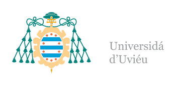

# **Who am I?**

I am Pablo Palencia, a postdoctoral researcher at Biodiversity Research Institute ([IMIB](https://imib.csic.es/)). I am interested on develop and fine-tuning cutting-edge tools for wildlife management and conservation, wit a special mention of camera trapping ;). 

Definitively, the use of **camera traps** for address conservation and management challenges is one my main research lines. Briefly, I started to use camera traps during my internship period at [IREC](https://www.irec.es/) in 2015. Then, during my master and PhD, I spent most of the time developing and harmonizing camera trapping methods to estimate population density, with a special mention to random encounter model [**REM**](https://zslpublications.onlinelibrary.wiley.com/doi/full/10.1002/rse2.269). Now, as postdoctoral researcher, I continue working with cameras: fine-tuning [sampling design](https://besjournals.onlinelibrary.wiley.com/doi/full/10.1111/1365-2664.14690), integrating them in [diseases surveillance programs](https://www.sciencedirect.com/science/article/abs/pii/S0034528823003491), using them as non-invasive tool to monitor [endangared populations](https://link.springer.com/article/10.1007/s10344-024-01837-9), integrating [artificial intelligence workflows](https://besjournals.onlinelibrary.wiley.com/doi/full/10.1111/2041-210X.14450), and much more...

### [See here a short version of my CV ](https://pablopalencia.github.io/web/CVsummary.html)

